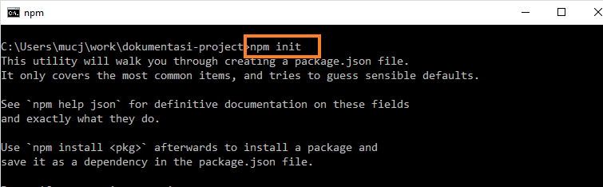
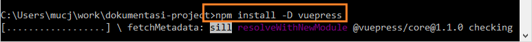
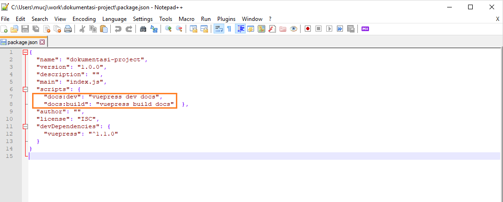

# Tutorial Dokumentasi menggunakan Vuepress 
Tulisan ini berisi langkah-langkah menggunakan vuepress untuk keperluan konten static web seperti dokumentasi, petunjuk teknis, FAQ, dan seterusnya. 

Secara garis besar tutorial ini terdiri dari kebutuhan software apa saja supaya sistem dapat menjalankan vuepress, kemudian konfigurasi project vuepress, serta terakhir berupa pengisian konten project tersebut.

## Requirement Software
### npm 

#### Download npm (melalui nodejs)

NPM sendiri didistribusikan melalui software node yang artinya saat node.js diinstall, otomatis npm ikut terinstall. Pada saat tutorial ini dibuat, digunakan **node versi 10.16.3.** yang bisa didapatkan langsung dari [website nodejs](https://nodejs.org/en/).


Klik download button versi yang terdapat tulisan ***LTS***
<br>

#### Install nodejs

Lakukan instalasi nodejs pada sistem dengan langkah-langkah seperti software lain pada umumnya


Pada screenshoot tutorial ini diurutkan langkah instalasi dari kiri ke kanan. **Checked** pada opsi **checkbox License Agreement**


Biarkan secara **default** pada window pilih direktori instalasi, serta pada windows fitur-fitur yang akan diinstall


Konfirmasi install nodejs dengan pilih button ***Yes***


Tunggu proses instalasi hingga selesai, diakhiri klik button ***Finish***


<br>

#### Verifikasi npm & node
Untuk memastikan terinstall, lakukan verifikasi melalui commandpromt / cmd. Klik start windows, ketik cmd lalu arahkan mouse dan klik kiri. 


Setelah muncul Comand Prompt, masukan baris kode berikut satu per satu dilajutkan menekan keyboard Enter <br>
cek versi npm : 

`npm -v`

cek versi nodejs: 

`node -v` 


Ditampilkannya versi node sesuai installer di awal menandakan instalasi berhasil dilakukan di sistem

### vuepress 

Vuepress biasa digunakan sebagai static site generator yang dioptimalkan untuk pembuatan dokumentasi teknis. Instalasi vuepress akan dibahas pada bagian selanjutnya yaitu setup project
<br>

## Setup Project

### Instalasi vuepress

- Tentukan **direktori project**. Default lokasi awal biasanya terletak di C:\Users\nama_user\ . 
  Untuk membuat folder project baru, ketikan command: `mkdir nama_project` , maka otomatis direktori itu ditambahkan <br>
  Lalu arahkan command line aktif ke direktori project tsb. `cd nama_project`  

  


- Buat **konfigurasi awal** project dengan command: `npm init `. Nantinya npm akan melakukan generate 1 file, yaitu package.json 

  

  Tekan tombol keyboard Enter di setiap input command untuk membiarkan konfigurasi secara default. Untuk keperluan vuepress ini, file **package.json** ini nantinya akan diubah. Ketik ***yes*** untuk konfirmasi terakhir.

  

- **Install vuepress** sebagai dependensi local  berdasarkan dokumentasi <br><https://vuepress.vuejs.org/guide/getting-started.html#inside-an-existing-project> <br>
  Masih di direktori project, ketik command: `npm install -D vuepress` 

  

  Tunggu proses instalasi vuepress hingga selesai dan muncul teks **+ vuepress ... added packages** seperti gambar berikut

  


### File README

- Create file baru **README.md** di dalam direktori docs dari command line <br>
  Masih di direktori project, buat direktori docs  menggunakan command: `mkdir docs` <br>
  Dilanjutkan create file README.md sebagai permulaan konten project, dengan command:  <br>`echo '# Hello VuePress' > docs/README.md` lalu tekan Enter. <br>Maka file README.md akan tergenerate otomatis di dalam folder docs

- Ubah script pada file **package.json**
  

  Hapus semua key kecuali **scripts** dan **devDependencies**. Ubah key script menjadi berikut:
```
{
  "scripts": {
    "docs:dev": "vuepress dev docs",
    "docs:build": "vuepress build docs"
  }
}
```



Setelah diatur hanya key **scripts** dan **devDependencies** yang digunakan, simpan perubahan file package.json 

#### Preview static web

- Untuk preview kontennya pada mode development, ketik command `npm run docs:dev` 
  

  Buka URL default tersebut di browser <br>
  <http://localhost:8080/>  <br>

  Secara default favicon dan logo tidak akan seperti gambar berikut. Di sini telah berubah akibat sedikit konfigurasi lebih lanjut yang akan dibahas di bagian [Konfigurasi Project](#konfigurasi-project) <br>

- Untuk mengehentikan runtime, lakukan terminate mode development tersebut dengan menekan keyboard **Ctrl+C** sebanyak 1 sampai 2 kali, lalu ketik Y. <br>


Selama pembuatan konten vuepress preview akan ditampilkan secara realtime, sedangkan untuk perubahan heading level dan konfigurasi, runtime perlu di terminate lalu running ulang dengan command `npm run docs:dev` supaya terlihat hasil perubahannya.


### Konfigurasi Project

#### Struktur Folder 

Pada vuepress struktur folder yang dimiliki cukup fleksibel. Pada pproject ini, akan berfokus pada folder yang ditandai sesuai gambar di bawah

1. Folder **public**

   menyimpan sumber logo static web, dan favicon 

2. File **config.js**

   Mengatur title, logo, deskripsi, dan seterusnya <br>
   <https://vuepress.vuejs.org/guide/basic-config.html#config-file> 


Struktur Project Vuepress (sumber: <https://vuepress.vuejs.org/guide/directory-structure.html> )

Buat struktur Folder tersebut. Dari direktori project aktif, arahkan ke dalam folder docs: 
`cd docs`

buat folder .vuepress: 
`mkdir .vuepress`

buat folder public di dalam folder .vuepress:
`mkdir .\.vuepress\public`


buat file config.js (berupa script kosong) di dalam folder .vuepress:
`echo '' > .\.vuepress\config.js`


#### Edit konfigurasi 

Ubah script konfigurasi di file **config.js** tadi untuk mengatur icon, title page, dan sebagainya <https://vuepress.vuejs.org/theme/default-theme-config.html> 

```
module.exports = {
  title: 'Title Static Web',
  description: 'Deksripsi Static Web',
  themeConfig: {
    docsDir: 'docs',
    logo: '/sampleicon.png'
  }
}
```


Icon logo pada header dan favicon diambil dari folder public


<br>

## Edit Konten

Edit konten terdapat di file **README.md**. Link

[Tutorial Dokumentasi menggunakan Markdown](./dokumentasi-project/docs/README.md)


