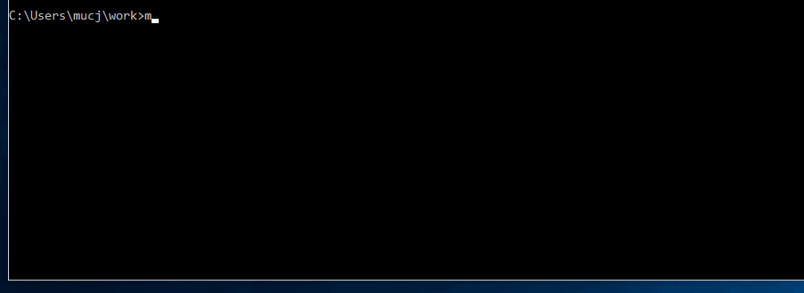
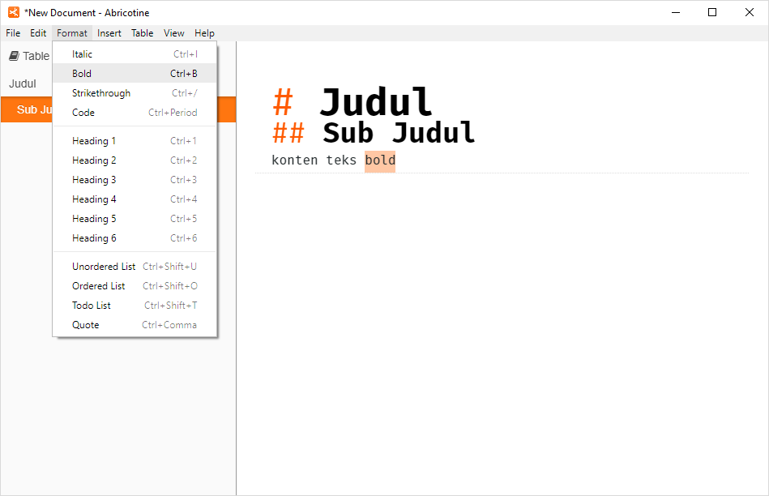

# Tutorial Dokumentasi menggunakan Vuepress 
Tulisan ini berisi langkah-langkah menggunakan vuepress untuk keperluan konten static web seperti dokumentasi, petunjuk teknis, FAQ, dan seterusnya. 

Secara garis besar tutorial ini terdiri dari kebutuhan software apa saja supaya sistem dapat menjalankan vuepress, kemudian konfigurasi project vuepress, serta terakhir berupa pengisian konten project tersebut.

## Requirement Software
### npm 

#### Download npm (melalui nodejs)

NPM sendiri didistribusikan melalui software node yang artinya saat node.js diinstall, otomatis npm ikut terinstall. Pada saat tutorial ini dibuat, digunakan **node versi 10.16.3.** yang bisa didapatkan langsung dari [website nodejs](https://nodejs.org/en/).


Klik download button versi yang terdapat tulisan ***LTS***
<br>

#### Install nodejs

Lakukan instalasi nodejs pada sistem dengan langkah-langkah seperti software lain pada umumnya


Pada screenshoot tutorial ini diurutkan langkah instalasi dari kiri ke kanan. **Checked** pada opsi **checkbox License Agreement**


Biarkan secara **default** pada window pilih direktori instalasi, serta pada windows fitur-fitur yang akan diinstall


Konfirmasi install nodejs dengan pilih button ***Yes***


Tunggu proses instalasi hingga selesai, diakhiri klik button ***Finish***


<br>

#### Verifikasi npm & node


Untuk memastikan terinstall, lakukan verifikasi melalui commandpromt / cmd. Klik start windows, ketik cmd lalu arahkan mouse dan klik kiri. 


Setelah muncul Comand Prompt, **masukan baris kode** berikut satu per satu dilanjutkan menekan **keyboard Enter** <br>
cek versi npm : 

`npm -v` 

cek versi nodejs: 

`node -v` 


Ditampilkannya versi node sesuai installer di awal menandakan instalasi berhasil dilakukan di sistem

### vuepress 

Vuepress biasa digunakan sebagai static site generator yang dioptimalkan untuk pembuatan dokumentasi teknis. Instalasi vuepress akan dibahas pada bagian selanjutnya yaitu setup project
<br>

## Setup Project Lokal

### Instalasi vuepress

Vuepress diinstall melalui paket npm, sehingga project di-inisiasi melalui npm<br>


- Tentukan **direktori project**. Default lokasi awal biasanya terletak di C:\Users\nama_user\  <br>
  Untuk membuat folder yang dijadikan sebagai lokasi project, ketikan command: `mkdir nama_project` <br>
  Lalu arahkan command line aktif ke direktori project tsb. `cd nama_project`  

  

<br>

- Buat **konfigurasi awal** project dengan command: `npm init `. Nantinya npm akan melakukan generate 1 file, yaitu package.json dan 1 folder node_modules. Untuk keperluan vuepress, file **package.json** ini nantinya akan diubah.  <br>

  

  Tekan tombol keyboard Enter di setiap input command untuk membiarkan konfigurasi secara default, dan ketik ***yes*** untuk konfirmasi.

  

- Dilanjutkan **install vuepress** sebagai dependensi local  berdasarkan dokumentasi dari [vuepress](https://vuepress.vuejs.org/guide/getting-started.html#inside-an-existing-project) <br>
  Di direktori project, ketik command: `npm install -D vuepress` 

  

  Tunggu proses instalasi vuepress hingga selesai--di tahap ini proses berlangsung lebih lama. Jika berhasil maka muncul teks seperti gambar berikut

  


### File README

File README.md akan diisi konten dokumentasi, petunjuk teknis, FAQ. 


Melalui command line, create file baru **README.md** di dalam direktori docs. Berikut langkah-langkah inisiasi project <br>

Di direktori project, buat folder docs menggunakan command: `mkdir docs` <br>

Create file README.md sebagai permulaan konten project, dengan command:  `echo '# Hello VuePress' > docs/README.md`.<br>

Maka file README.md yang berisi '# Hello VuePress' akan tergenerate otomatis <br>
  

### File package.json

File package.json berfungsi sebagai konfigurasi identitas project, termasuk setting script yang dieksekusi pada saat running project


- Masih di direktori project, ubah script pada file **package.json** menggunakan text editor
  

  Ubah key **script** menjadi berikut:
```
{
  "scripts": {
    "docs:dev": "vuepress dev docs",
    "docs:build": "vuepress build docs"
  }
}
```


Setelah ditambahkan script vuepress untuk mode development & mode build, simpan perubahan file package.json tersebut 

<br>

### Preview static web

Setelah script disesuaikan, running project untuk melihat hasil konten menggunakan browser


- Untuk preview kontennya pada mode development, ketik command `npm run docs:dev` 
  

  Buka URL [localhost](http://localhost:8080/) default tersebut di browser <br>

  Secara default favicon dan logo tidak akan seperti gambar berikut. Di sini telah berubah akibat konfigurasi lebih lanjut yang akan dibahas di bagian [Konfigurasi Project](#konfigurasi-project) <br>
  Konten yang ditampilkan merupakan hasil preview dari file README.md <br>
  
  
- Untuk menghentikan runtime, lakukan terminate mode development tersebut dengan menekan keyboard **Ctrl+C** sebanyak 1 sampai 2 kali, lalu ketik Y. <br>


Selama pembuatan konten vuepress preview akan ditampilkan secara realtime, sedangkan untuk perubahan heading level dan konfigurasi, runtime perlu di terminate lalu running ulang dengan command 

 `npm run docs:dev`  <br>


<br>
### Konfigurasi Project

#### Struktur Folder 


Pada vuepress struktur folder yang dimilikinya fleksibel. Pada pproject ini, akan berfokus pada folder yang ditandai sesuai gambar 

1. Folder **public**

   menyimpan sumber logo static web, dan favicon 

2. File **config.js**

   Mengatur title, logo, deskripsi, dan seterusnya sesuai ketentuan [vuepress basic-config](https://vuepress.vuejs.org/guide/basic-config.html#config-file) 


Berikut cara membuat struktur project mengacu dari [vuepress](https://vuepress.vuejs.org/guide/directory-structure.html)


Buat struktur Folder tersebut. Dari direktori project aktif, arahkan ke dalam folder docs: 
`cd docs`

buat folder .vuepress: 
`mkdir .vuepress`

buat folder public di dalam folder .vuepress:
`mkdir .\.vuepress\public`


buat file config.js (berupa script kosong) di dalam folder .vuepress:
`echo '' > .\.vuepress\config.js`


#### Edit konfigurasi web

Konfigurasi file [config.js vuepress](https://vuepress.vuejs.org/guide/basic-config.html#config-file) menjadi file esensial yang mengatur web vuepress yang dapat melakukan export javascript object seperti mengatur icon, title page, navigasi menu dan seterusnya. Hal ini akan terlihat saat running sebagai development server.


Caranya di folder .vuepress, edit script [konfigurasi](https://vuepress.vuejs.org/theme/default-theme-config.html) pada file **config.js**  seperti berikut 

```
module.exports = {
  title: 'Title Static Web',
  description: 'Deksripsi Static Web',
  themeConfig: {
    docsDir: 'docs',
    logo: '/sampleicon.png'
  }
}
```


Icon **logo** pada header dan favicon diambil dari folder public


<br>

## Edit Konten

Edit konten terdapat di file **README.md**. Link hasil dari konten yang dimuat di tulisan ini dapat dilihat di [Tutorial Dokumentasi menggunakan Markdown](./dokumentasi-project/docs/README.md#format) 

### Setup markdown editor

Sebelum mulai menyusun konten, pastikan terlebih dahulu markdown editor seperti [Haroopad](http://pad.haroopress.com/user.html), [Abricotine](https://github.com/brrd/Abricotine/releases), atau [Marktext](https://github.com/marktext/marktext/releases) terinstall di sistem. 

#### Install markdown editor

*Abricotine* yang digunakan pada tulisan ini bisa didapatkan dari link githubnya [berikut](https://github.com/brrd/Abricotine/releases/download/0.7.0/Abricotine-0.7.0-windows-x64.exe) <br>


Untuk menginstall lakukan **klik kanan > Open** pada file installer tersebut. <br>


Setelah selesai otomatis muncul dialog konfirmasi untuk menjalankan Abticotine, pilih ***Run***


#### Setting workspace editor

Untuk mempermudah navigasi selama melakukan editing, sebaiknya atur sedikit tampilan workspace dari text editor, seperti tampilan navigasi / outline dari tulisan yg sedang dibuat. <br>


Pilih menubar **View > Show Table of Contents**. Lakukan editing awal file markdown, contoh di gambar berikut menggunakan heading level 1 dan level 2, serta teks paragraf. <br>



untuk melakukan format tulisan contohnya format bold, lakukan **sorotan pada teks untuk menyeleksi** dilanjutkan pilih menubar **Format > Bold**


Maka format teks tersebut akan mengikuti formatter syntax markdown secara otomatis melalui menu. Untuk syntax lebih lanjut dapat dilihat di [markdownguide.org](https://www.markdownguide.org/basic-syntax/)

<br>

### Editing markdown

Sedangkan apabila akan melakukan editing terhadap file markdown yang sudah ada, pilih menubar **File > Open** <br>


Pilih file README.md yang dibuat di awal project di dalam folder docs.


 Lalu konten yang telah dibuat di atas akan terlihat