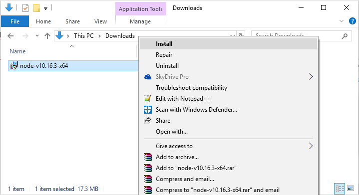
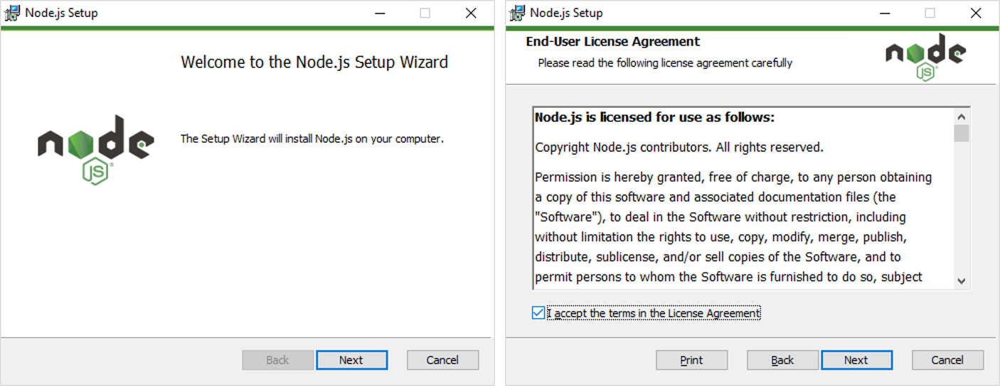
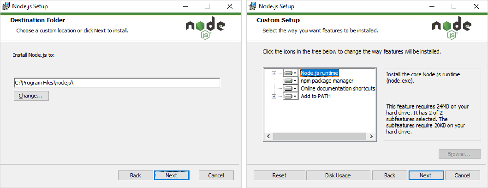
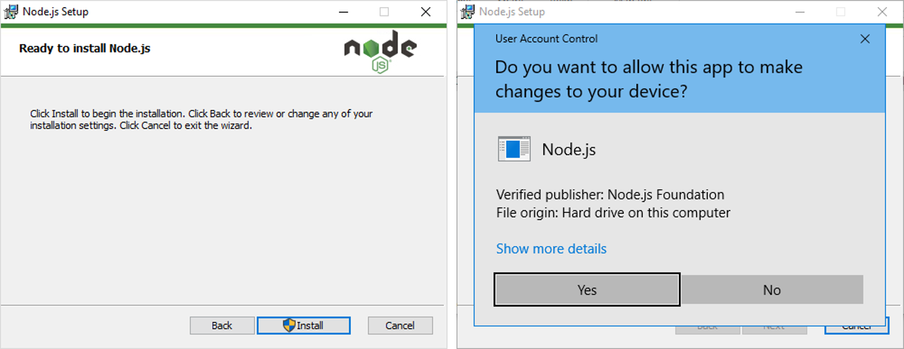
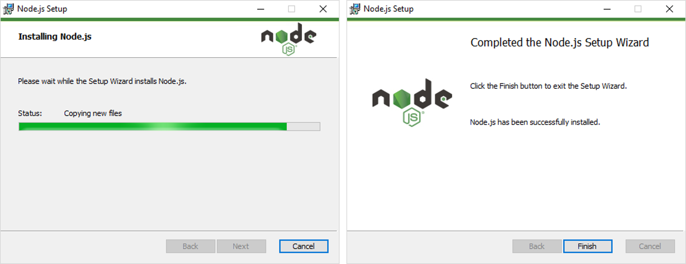
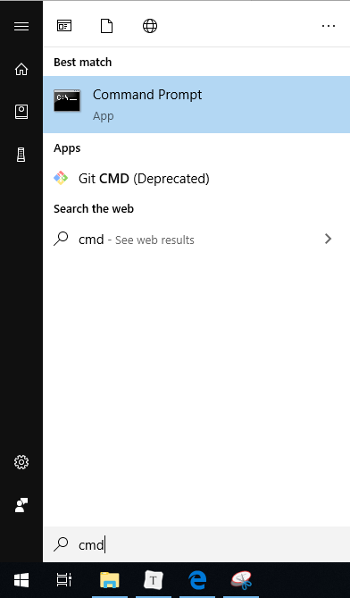
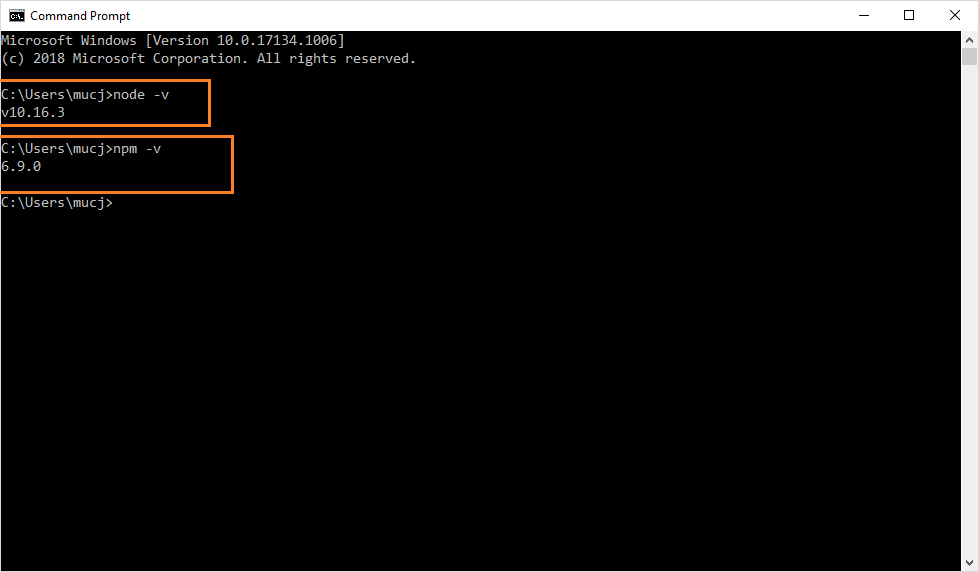

# Tutorial Dokumentasi menggunakan Vuepress 
Tulisan ini berisi langkah-langkah menggunakan vuepress untuk keperluan konten static web seperti dokumentasi, petunjuk teknis, FAQ, dan seterusnya. 

Secara garis besar tutorial ini terdiri dari kebutuhan software apa saja supaya sistem dapat menjalankan vuepress, kemudian konfigurasi project vuepress, dilanjutkan terakhir pengisian konten project tersebut.

## requirement software
### npm 

#### Download npm (melalui nodejs)

NPM sendiri didistribusikan melalui software node yang artinya saat node.js diinstall, otomatis npm ikut terinstall. Pada saat tutorial ini dibuat, digunakan **node versi 10.16.3.** yang bisa didapatkan langsung dari [website nodejs](https://nodejs.org/en/).


Klik download button versi yang terdapat tulisan ***LTS***


#### Install nodejs

Lakukan instalasi nodejs pada sistem dengan langkah-langkah seperti software lain pada umumnya. 



Pada screenshoot tutorial ini diurutkan langkah instalasi dari kiri ke kanan. Checked pada opsi checkbox License Agreement.



Biarkan secara default pada window pilih direktori instalasi, serta pada windows fitur-fitur yang akan diinstall.



Konfirmasi install nodejs dengan pilih button ***Yes***



Tunggu proses instalasi hingga selesai, diakhiri klik button ***Finish***




#### Verifikasi npm & node
Untuk memastikan terinstall, lakukan verifikasi melalui commandpromt / cmd. Klik start windows, ketik cmd lalu arahkan mouse dan klik kiri. 



Setelah muncul Comand Prompt, masukan baris kode berikut satu per satu dilajutkan menekan keyboard Enter
cek versi npm : 

`npm -v`

cek versi nodejs: 

`node -v` 



Ditampilkannya versi node sesuai installer di awal menandakan instalasi berhasil dilakukan di sistem


### vuepress 

[web vuepress doc](https://vuepress.vuejs.org/guide/getting-started.html#inside-an-existing-project) 


## setup project
- Tentukan **direktori project**. default lokasi awal di windows terdapat di C:\Users\nama_user\. setelah itu arahkan command line ke direktori project tsb.  lalu buat konfigurasi awal project dgn command: `npm init `
- **Install vuepress** sebagai dependensi local
- create file baru **README.md** di dalam direktori docs

```
# install as a local dependency
npm install -D vuepress

# create a docs directory
mkdir docs
# create a markdown file
echo '# Hello VuePress' > docs/README.md
```

- tambahkan script di file **package.json**
```
{
  "scripts": {
    "docs:dev": "vuepress dev docs",
    "docs:build": "vuepress build docs"
  }
}
```

- untuk preview kontennya pada mode development, ketik command `npm run docs:dev` 
- untuk generate kontennya sebagai static web, ketik command `npm run docs:build` 

akan ter-generate direktori **.vuepress** di dalam **project_folder\docs\** 

ubah konfigurasi file **config.js** untuk mengatur icon, title page, dsb [vuepress config](https://vuepress.vuejs.org/guide/basic-config.html#config-file)  dengan script

```
module.exports = {
  title: 'Dokumentasi PMB Online',
  description: 'Petunjuk penggunaan PMB Online',
  themeConfig: {
    docsDir: 'docs',
    logo: '/suteki.png'
  }
}
```

## edit konten
untuk edit konten terdapat di file **README.md** 


